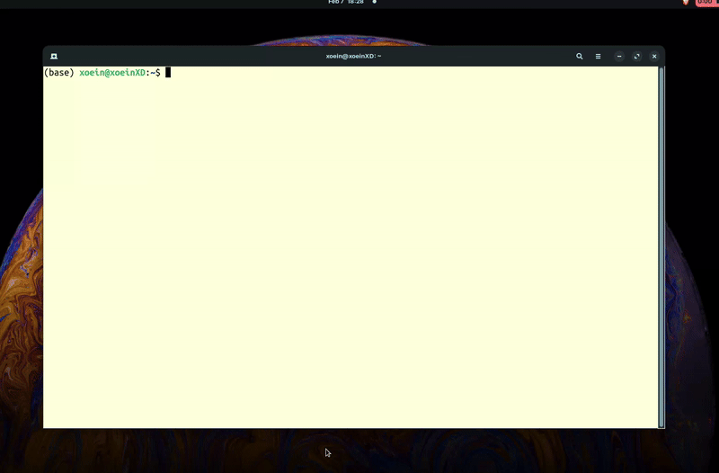

# Vertex CLI

A modern CLI tool for interacting with multiple LLMs using LangChain.

## Features

- Unified interface for multiple LLM providers (Google Gemini, OpenAI, Anthropic Claude)
- Clean architecture following SOLID principles
- Conversation history management
- Bash command debugging
- Easy model switching

## Installation

```bash
git clone https://github.com/Prtm2110/Vertex-CLI.git
cd Vertex-CLI
pip install -e .
```

## Quick Start

```bash
# Initialize configuration
tex --setup

# Configure a model (provider auto-detected from model name)
tex config gemini-2.5-flash YOUR_API_KEY
tex config gpt-4 YOUR_OPENAI_KEY
tex config claude-3-opus YOUR_ANTHROPIC_KEY

# Or specify provider explicitly
tex config my-model YOUR_KEY --provider google

# Select active model
tex select gemini-2.5-flash

# Use it
tex "explain quantum computing"
```

## Commands

```bash
tex "your question"                  # Ask a question
tex chat <text>                      # Chat mode
tex debug                            # Debug bash commands
tex config <model> <api_key>         # Configure model (auto-detects provider)
tex config <model> <key> --provider <provider>  # Specify provider explicitly
tex list                             # List models
tex select <model>                   # Select active model
tex remove <model>                   # Remove model
```

## Supported Providers

- **Google Gemini**: `google` or `gemini`
- **OpenAI**: `openai`
- **Anthropic**: `anthropic` or `claude`

## Configuration

Models are configured in `~/.config/ai_model_manager/models_config.json`

Example configuration:
```json
{
  "selected_model": "gemini-2.5-flash",
  "models": {
    "gemini-2.5-flash": {
      "provider": "google",
      "api_key": "your-api-key",
      "temperature": 0.7
    }
  }
}
```

## Documentation

- [Architecture](docs/ARCHITECTURE.md) - Technical architecture

## Requirements

- Python 3.8+
- LangChain and provider packages

## License

See [LICENSE](LICENSE) file.
   tex-init
   ```

---

## Configuration

You can configure the CLI to use a specific LLM model by adding or updating your API key:

```bash
tex config gemini-1.5-flash YOUR_MODEL_API_KEY
```

Replace `gemini-1.5-flash` with your preferred model name and `YOUR_MODEL_API_KEY` with your API key.

To list all configured models:

```bash
tex list
```

To remove a model:

```bash
tex remove gemini-1.5-creative
```

To select a model as the default:

```bash
tex select gemini-1.5-flash
```

---

## Usage

Once installed and configured, you can start chatting or debugging commands:

### Chat with the LLM

You can either use the `chat` subcommand or omit it entirely:

```bash
# Explicit subcommand
tex chat "Tell me about the solar system"

# Shortcut form (no subcommand)
tex "Tell me about the solar system"
```

Replace the quoted string with any query you'd like.



🔗 **Complete CLI Documentation:** [CLI Commands](https://prtm2110.github.io/Vertex-CLI/cli_tool_docs/)

---

## Debugging Mode (Beta Feature)

Debugging is currently in beta but can analyze recent shell commands to identify issues.

### Debug the Last 3 Commands (default)

```bash
tex debug
```

### Specify the Number of Commands to Debug

```bash
tex debug -n 5
```

### Add a Custom Debugging Message

```bash
tex debug -n 5 -p "Explain why \`git commit\` failed"
```

---

## Contributing

Contributions are welcome! Follow these steps to contribute:

1. **Fork the repository**
2. **Create a new branch**:

   ```bash
   git checkout -b feature/your-feature-name
   ```
3. **Commit your changes**:

   ```bash
   git commit -m "Add your feature description"
   ```
4. **Push your branch**:

   ```bash
   git push origin feature/your-feature-name
   ```
5. **Open a pull request**

🔗 **Contributor Guide:** [How to Contribute](https://prtm2110.github.io/Vertex-CLI/contributors_guide/)

---

## License

This project is licensed under the MIT License. See the [LICENSE](https://github.com/Prtm2110/Vertex-CLI/blob/main/LICENSE) file for more details.

---

## Support

If you encounter any issues, open an issue on the **[GitHub repository](https://github.com/Prtm2110/Vertex-CLI/issues)**.
